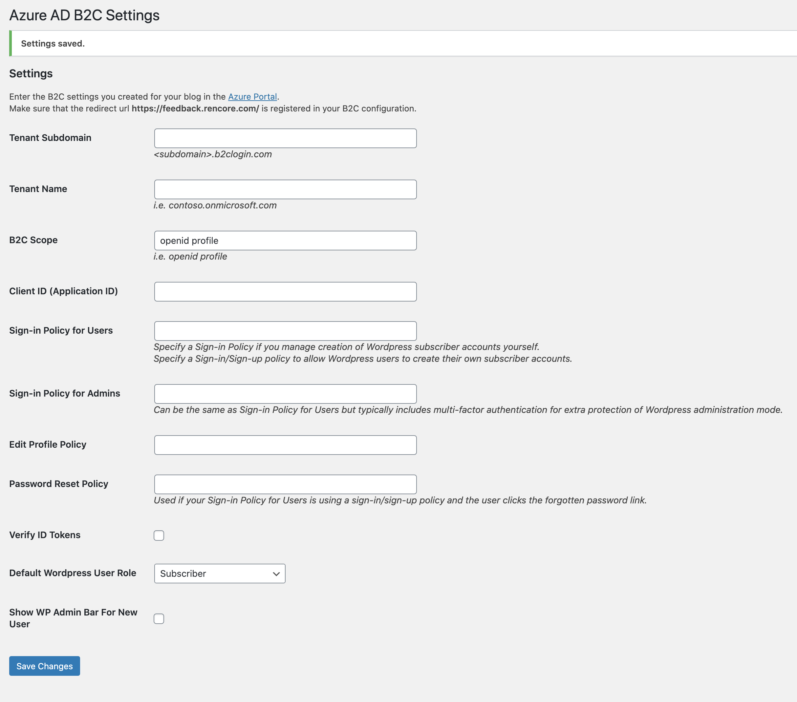

## Updated code to fully support b2clogin.com as off May 2020
- Updated to support b2clogin
- added support for setting B2C Scope
- added support for password reset folicy
- added support for setting the default new user role
- added support for retrieving display name
- added error handling for claims that don't exist in B2C tenant (eg. firstname, lastname)
- updated phpseclib to latest release 2.0.27
- fixed issue with falsely encoded redirect after authentication
- added error handling for cancelled sign-in/-up flow and pwd reset flow
- updated settings descriptions
- change redirect url from site_url() to home_url()
- fixed settings submission issues for unset b2c_verify_tokens config element
- added ability to set if new users show see the admin bar or not

### Screenshot of settings page

## active-directory-b2c-wordpress-plugin-openidconnect
This repo contains the code for a WordPress plugin that allows users to authenticate with Azure AD B2C using OpenID Connect. Admins have the ability to configure several B2C policies: general sign-in/sign-up without multifactor authetication, admin sign-in/sign-up with multifactor authentication (optional), and profile editing. 

A live version of a WordPress site with this plugin installed is available here: https://olenasblog.azurewebsites.net/ 

## Pre-requisites
+ Install WordPress ([download link](https://codex.wordpress.org/Installing_WordPress))
+ Optional: Deploy your WordPress site to Azure ([instructions](https://azure.microsoft.com/en-us/documentation/articles/app-service-web-create-web-app-from-marketplace/))

## Use the Azure Portal to Create B2C Policies
+ Create a sign-in/sign-up policy and an edit profile policy.
+ Optional: Create a different sign-in policy for admins.
+ For detailed instructions, see [here](https://azure.microsoft.com/en-us/documentation/articles/active-directory-b2c-reference-policies/).

## Downloading and Installing this Plugin
+ Download this source code from github as a zip file.
+ Login to your WordPress site as an admin.
+ Navigate to your Dashboard > Plugins > Add New > Upload Plugin.
+ Upload the zip file, then activate the plugin.
+ On your Admin dashboard, a new options page called "B2C Authentication Settings" should appear under the Settings button. 
+ Click on that page and fill in the prompts for tenant, clientID, etc.

## More information
B2C is an identity management service for both web applications and mobile applications. Developers can rely on B2C for consumer sign up and sign in, instead of relying on their own code. Consumers can sign in using brand new credentials or existing accounts on various social platforms (Facebook, for example). 

Learn more about B2C here: https://azure.microsoft.com/en-us/services/active-directory-b2c/
